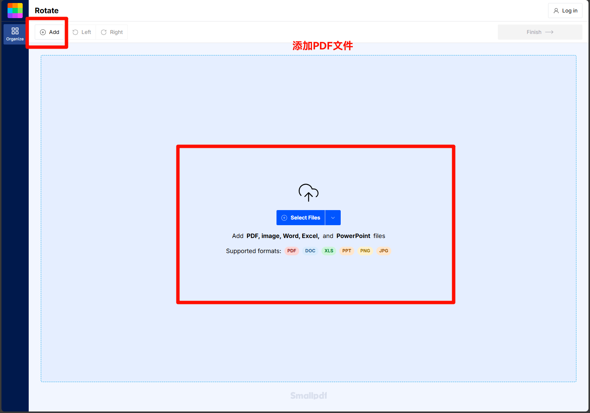
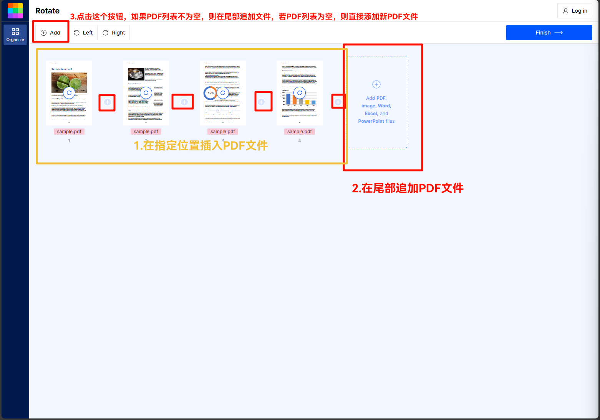
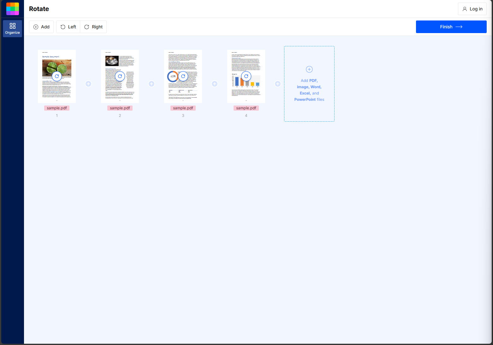
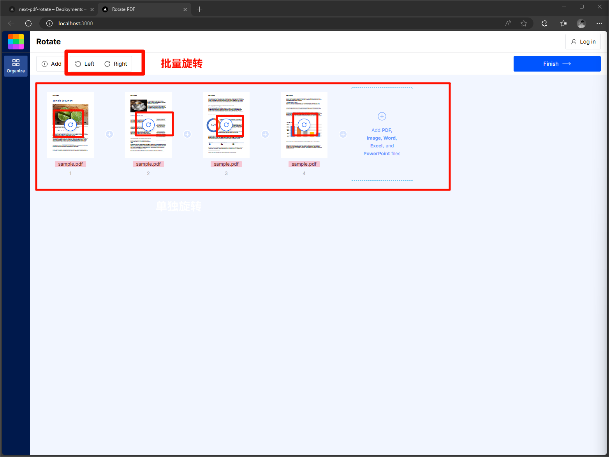
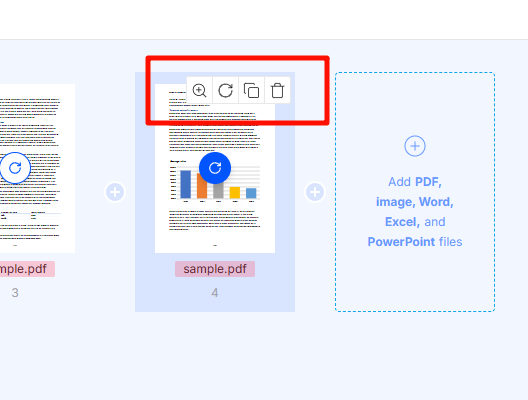
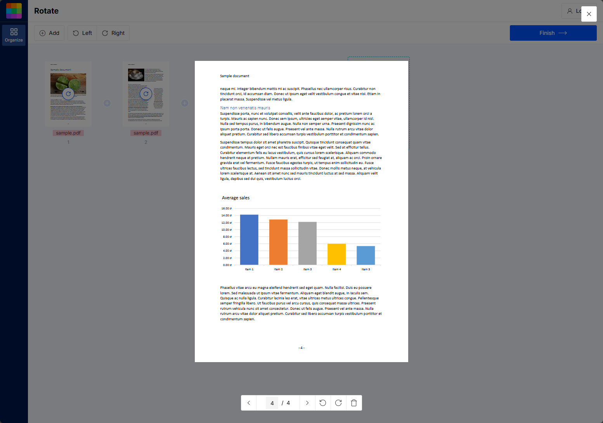
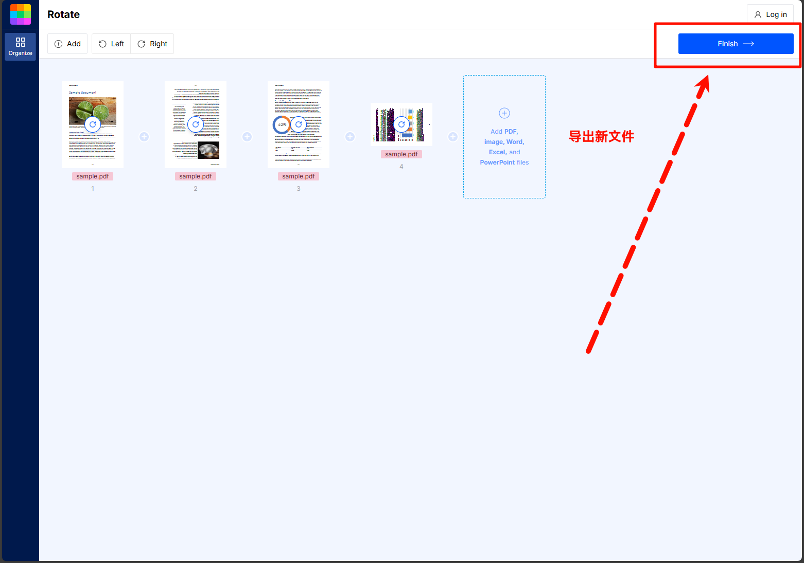
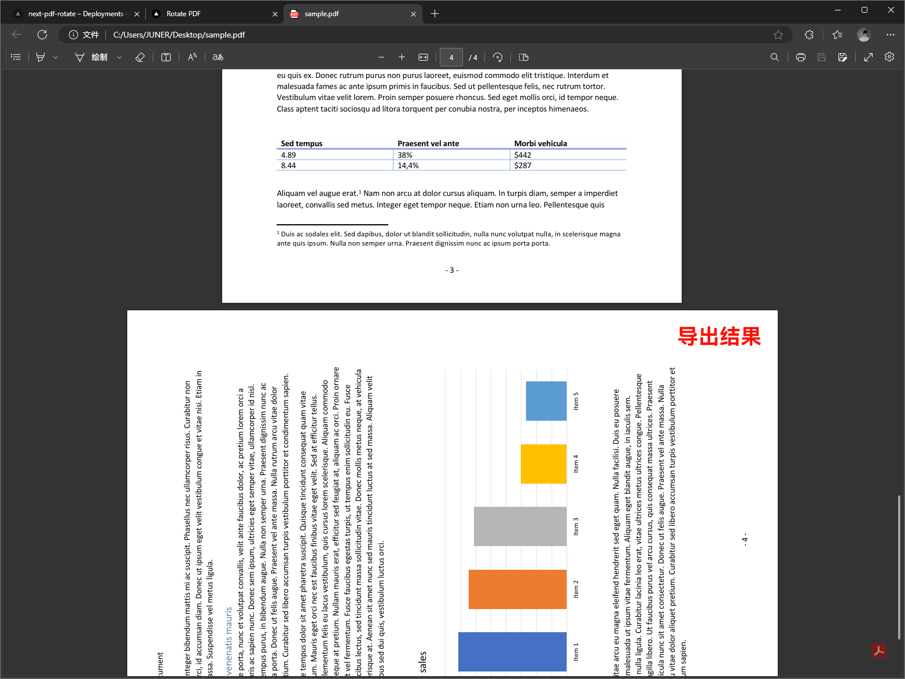

# 基于Next的PDF旋转小工具
## 1.安装依赖
 ```bash
 pnpm install
 ```
 ```bash
 pnpm dev
 ```

## 2.导入文件
 - 点击左上角 `Add` 按钮和中间蓝色区域添加 `PDF文件`
 
 - 其他导入方式
 
 - 导入PDF成功显示如下界面
 

 ## 3.旋转文件（后续还有旋转方式）
 - 点击 `上方控制器` 可进行批量旋转，点击每一个 `Page` 文件的 `中心旋转图标` 会单独对这个 `Page` 进行旋转
 

 ## 4.Page控制器
 - 鼠标悬浮在 `Page` 上方，会显示单独的 `Page控制器`
 - 控制器第一个选项 `是打开全屏预览窗口`
 - 控制器第二个选项 `是顺时针旋转Page`
 - 控制器第三个选项 `是单独拷贝这个Page，并在这个Page的后方插入拷贝出来的新Page`
 - 控制器第四个选项 `删除当前Page`
 

 ## 5.全屏预览器
  - 全屏浏览器 `上方有关闭按钮`，中间是 `当前PDF Page`，底部是 `控制器`
  - 点击 `遮罩` 和 `关闭按钮` 均可关闭全屏浏览器
  - 控制器 可`点击按钮切换页面`、也可以 `输入指定页码进行切换`
  - 控制器包含 `旋转` 和 `删除` 当前 `Page` 选项
 

  ## 6.文件导出
  - 点击右上方 `Finish` 按钮可导出结果到本地
  - 文件名默认是 `导入时的文件名`
  
  